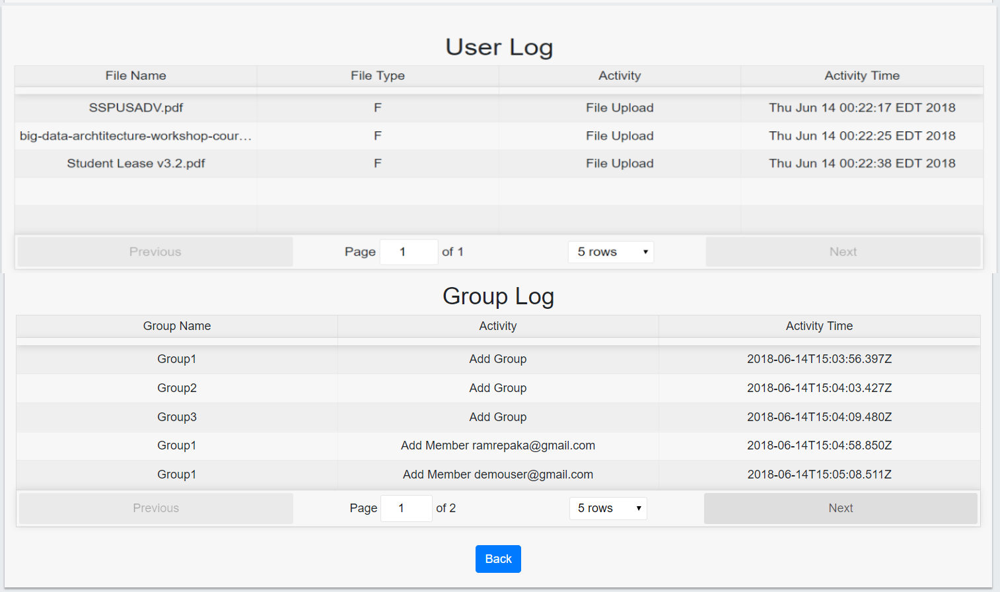

# Dropbox-React-SpringBoot
A Dropbox like web application using React.js | Java Spring Boot | Spring Data | Hibernate | MySQL

## Goal
* The goal is to build a distributed enterprise web application which enables the users to upload and delete files/folders and share files/folders to other users, create groups, add/delete members.
* The project was developed as Full Stack Web app using technologies such as React.js | Java Spring Boot | Spring Data | Hibernate | MySQL.

## System Design

### Architecture
* Web Application uses a Client-Server Architecture with:
  * Client components developed using React.js - Folder - '/react-frontend'   
  * Server Restful Api's developed using Java, Spring Boot, Spring Data, Hibernate - Folder - '/springboot-backend'

### Technology stack

<table>
<thead>
<tr>
<th>Area</th>
<th>Technology</th>
</tr>
</thead>
<tbody>
	<tr>
		<td>Front-End</td>
		<td>React, Redux, React Router, Bootstrap, HTML5, CSS3, Javascript ( ES6 )</td>
	</tr>
	<tr>
		<td>Authentication Middleware</td>
		<td>Passport.js</td>
	</tr>
	<tr>
		<td>Back-End</td>
		<td>Java, Spring Boot, Spring Data, Hibernate</td>
	</tr>
	<tr>
		<td>API Testing</td>
		<td>JUnit, Postman</td>
	</tr>
  <tr>
		<td>Database</td>
		<td>MySQL</td>
	</tr>
	<tr>
		<td>Performance Testing</td>
		<td>JMeter</td>
	</tr>
</tbody>
</table>

## Screenshots

##### HomePage/Login

##### Register

##### User Dashboard

##### User Details

##### User Logs/Group Logs

##### Delete Files

##### Create New Folder

##### Share Files

##### Groups & Members

